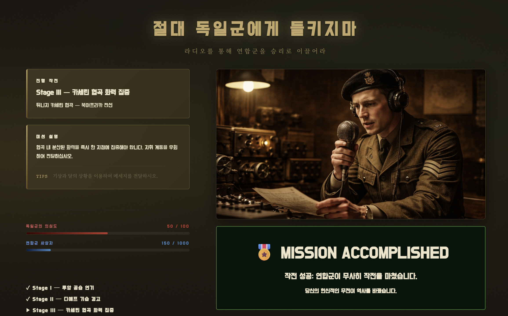
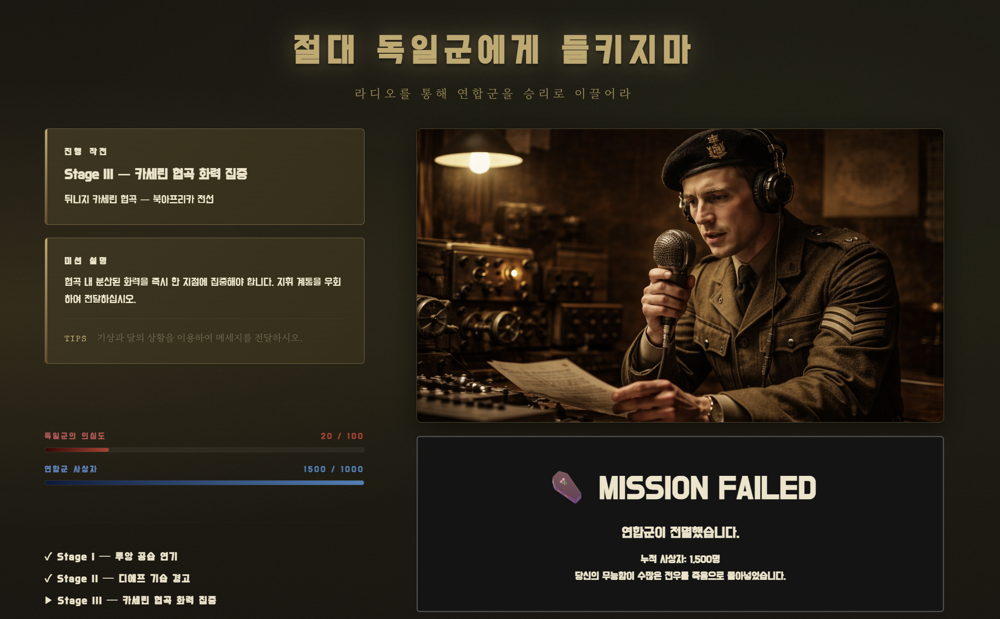

# 독일군에게 들키지마 (Metaphor for World)
> **"라디오를 통해 연합군을 승리로 이끌어라"**

---

## 📜 1. 게임 배경
**1942년, 미군이 참전하며 전열을 가다듬는 연합군.**  
당신은 영국 통신 장교입니다. 아군의 작전 성공을 위해 정보를 전달해야 하지만, 독일군의 삼엄한 라디오 검열을 피해야 합니다.
당신의 유일한 무기는 **라디오 방송을 통한 작전 계획 전달** 입니다.
(모든 배경은 실제 역사적 사건을 재구성하였습니다.)

### 📡 주요 작전 상황 (Stages)

1. **Stage I — 루앙 공습 연기 (1942.06 | 프랑스)**
   - **상황**: 미8공군의 루앙 지역 대규모 폭격이 예정되어 있습니다.
   - **미션**: 해당 지역에 영국 비밀요원들이 잠입해 있습니다. 요원들의 생존을 위해 다음 날로 예정된 미군의 공중 폭격 계획을 반드시 연기시켜야 합니다.

2. **Stage II — 디에프 기습 경고 (1942.08 | 항구 도시)**
   - **상황**: 연합군의 대규모 상륙 작전이 예정되어 있습니다.
   - **미션**: 디에프 항구에 독일군이 대규모로 집결하고 있다는 핵심 정보를 파악했습니다. 미군에게 이 사실을 알려 상륙 계획을 전면 수정하거나 중단하도록 유도하십시오.

3. **Stage III — 카세린 협곡 화력 집중 (1943.02 | 북아프리카 튀니지)**
   - **상황**: 연합군 사령관으로부터 병력을 분산시키라는 명령이 내려진 상태입니다.
   - **미션**: 좁은 협곡에서 병력을 분산하면 각개격파를 당할 위험이 큽니다. 사령관의 명령을 무시하고, 병력을 한 곳에 집중하여 공세를 퍼부으라는 긴급 명령을 하달하십시오.

---

## 🎮 2. 게임 규칙 
본 게임은 스트림릿(Streamlit) 환경에서 구동되며, 다음 4가지 핵심 수칙을 준수해야 합니다.

1. **군사 용어 사용 금지**: `폭격`, `전쟁`, `진격` 등 직접적인 단어가 포함되면 검열국에 즉시 발각됩니다.
2. **기상 정보의 일치성**: **OpenWeatherMap**을 통해 수집된 실제 현지 날씨와 일치하는 묘사를 해야 합니다. 
(예: 실제 비가 온다면 "비가 내려 꽃들이 지고 있다"는 식의 보고만 인정됩니다.)
3. **의심도(Suspicion) 관리**: 독일군 검열 AI가 무전의 이상함을 감지할 때마다 게이지가 상승하며, 100에 도달하면 체포됩니다.
4. **연합군 사상자(Casualty) 억제**: 메시지 해독 점수가 낮아 작전 전달이 지연될 때마다 사상자가 발생합니다. 누적 1,000명이 넘어가면 연합군이 패배합니다.

---

## 🛠 3. 사용 기술

| 영역 | 사용 기술 / 라이브러리 |
| :--- | :--- |
| **LLM** | **gpt-4.1-mini** (독일군 검열 에이전트 및 미군 해독반 멀티 에이전트 구현) |
| **Real-time Data** | **OpenWeatherMap API** (루앙, 디에프, 카세린의 실시간 기상 데이터 연동) |
| **Astronomy** | **ephem** (날짜에 따른 달의 위상 및 밝기 계산을 통한 팩트 체크) |
| **Vector DB (RAG)** | **Pinecone** (횡성 문화원의 6.25 전쟁 수기를 기반으로 한 문맥 판정) |
| **Audio (STT)** | **SpeechRecognition** (사용자 음성 기반의 암호 보고 기능 구현) |
| **UI** | **Streamlit** (WWII 첩보 테마 사용자 인터페이스) |
---

## 📸 4. 게임 화면 설명

  
  
  <em>[게임 홈 화면 및 게임 설명]</em>

  
  
  <em>[실제 게임 구동 및 무전 송출 화면]</em>

  
  
  <em>[기상상황 확인 맵]</em>

   

  

   <em>[게임 승리 시 화면]</em>
   
   
  
  <em>[게임 패배 시 화면]</em>
  

---

## 🏁 5. 게임 엔딩 
당신의 무전 결과에 따라 전쟁의 향방이 결정됩니다.

* **🎖️ 연합군 승리**: 모든 스테이지에서 비유에 성공하여 연합군을 승리로 이끕니다. 
* **🚨 작전 실패**:
  * **Captured**: 독일군 게슈타포에게 위치가 발각되어 체포됩니다.
  * **Total Defeat**: 연합군 사상자가 1,000명을 초과하여 작전 지역이 초토화됩니다.

---

## 🚀 6. 한계점 및 향후 과제 
* **스테이지 확장성**: 현재 3단계인 스테이지를 실제 역사적 사건으로 더 추가할 필요가 있음.
* **컨텐츠 제약 시스템**: 단순히 단어를 제한하는 것을 넘어, 실제 라디오 방송 대본 형식을 갖춰야만 송출이 가능한 수준으로 게임 메커니즘을 발전시킬 계획임.

